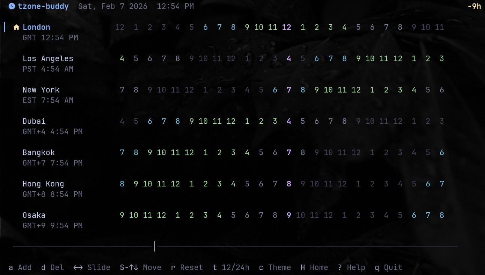

# 🌍 tzone-buddy

A beautiful terminal-based world clock TUI (Text User Interface) inspired by World Time Buddy. Keep track of multiple timezones right in your terminal with an intuitive interface and gorgeous themes.



## ✨ Features

- **📍 Multi-timezone display** - Track multiple cities and their local times simultaneously
- **⏰ Time sliding** - Navigate through past and future times to coordinate meetings
- **🎨 Beautiful themes** - Choose from 6 built-in color schemes including Catppuccin, Dracula, Nord, and more
- **🔍 Smart city search** - Fuzzy search through 500+ cities worldwide
- **⌨️ Vim-style navigation** - Intuitive keyboard shortcuts for power users
- **🔄 Auto-updates** - Automatically checks for and installs updates
- **🏠 Home timezone** - Always shows your system timezone at the top
- **📐 Responsive layout** - Adapts to your terminal size

## 📦 Installation

### One-line install (recommended)

```bash
curl -fsSL https://raw.githubusercontent.com/kurisu-agent/tzone-buddy/main/install.sh | bash
```

This will:
- Detect your platform (Linux/macOS, x64/arm64)
- Download the appropriate binary
- Install to `~/.local/bin`
- Add to PATH if needed

### Manual installation

Download the appropriate binary for your platform from the [latest release](https://github.com/kurisu-agent/tzone-buddy/releases/latest):

- Linux x64: `tzone-buddy-linux-x64`
- Linux ARM64: `tzone-buddy-linux-arm64`
- macOS x64: `tzone-buddy-darwin-x64`
- macOS ARM64: `tzone-buddy-darwin-arm64`

Then make it executable and move to your PATH:

```bash
chmod +x tzone-buddy-*
sudo mv tzone-buddy-* /usr/local/bin/tzone-buddy
```

### Build from source

Requirements: [Bun](https://bun.sh) runtime

```bash
git clone https://github.com/kurisu-agent/tzone-buddy.git
cd tzone-buddy
bun install
bun run build
```

## 🚀 Usage

Simply run:

```bash
tzone-buddy
```

## ⌨️ Keyboard Shortcuts

### Navigation
- `↑/k` `↓/j` - Select timezone row
- `←/h` `→/l` - Slide reference time ±1 hour
- `Shift+←` `Shift+→` - Slide ±1 day
- `Shift+↑` `Shift+↓` - Reorder cities

### Actions
- `a` - Add a new city
- `d` - Delete selected city
- `r` - Reset to current time
- `t` - Toggle 12/24 hour format
- `c` - Cycle through themes
- `H` - Toggle home timezone display
- `u` - Update (when available)
- `?` - Show help
- `q` - Quit

## 🎨 Themes

tzone-buddy includes 6 beautiful themes:

1. **Catppuccin Mocha** - Soothing pastel dark theme
2. **Catppuccin Latte** - Warm pastel light theme
3. **Dracula** - Popular dark theme with vibrant colors
4. **Nord** - Arctic, north-bluish color palette
5. **Tokyo Night** - Clean, dark theme inspired by Tokyo night lights
6. **Gruvbox Dark** - Retro groove color scheme

Press `c` to cycle through themes.

## 🔄 Auto-Updates

tzone-buddy automatically checks for updates on startup and every hour. When an update is available:
- You'll see "↑ Update available" in the status bar
- Press `u` to install the update
- The app will seamlessly replace itself and restart

## 📁 Configuration

Configuration is stored at `~/.config/tzone-buddy/config.json` (or `$XDG_CONFIG_HOME/tzone-buddy/config.json`).

The config file stores:
- Your selected cities
- Theme preferences (coming soon)
- Update check timestamps

## 🏗️ Architecture

- **Runtime**: [Bun](https://bun.sh) - Fast JavaScript runtime and bundler
- **Framework**: [React](https://react.dev) + [Ink](https://github.com/vadimdemedes/ink) - React for CLI apps
- **Language**: TypeScript
- **Time handling**: [Luxon](https://moment.github.io/luxon/) - Modern date/time library
- **Search**: [Fuse.js](https://fusejs.io/) - Fuzzy search

## 🤝 Contributing

Contributions are welcome! Please feel free to submit a Pull Request.

```bash
# Development
bun run dev      # Run with file watching
bun run dev:hot  # Run with hot reload
bun test         # Run tests
```

## 📝 License

MIT © 2024 kurisu-agent

## 🙏 Acknowledgments

- Inspired by [World Time Buddy](https://worldtimebuddy.com)
- Built with [Ink](https://github.com/vadimdemedes/ink) - React for CLIs
- Color schemes from [Catppuccin](https://github.com/catppuccin), [Dracula](https://draculatheme.com), [Nord](https://nordtheme.com), and others

---

Made with ❤️ for terminal enthusiasts who juggle multiple timezones